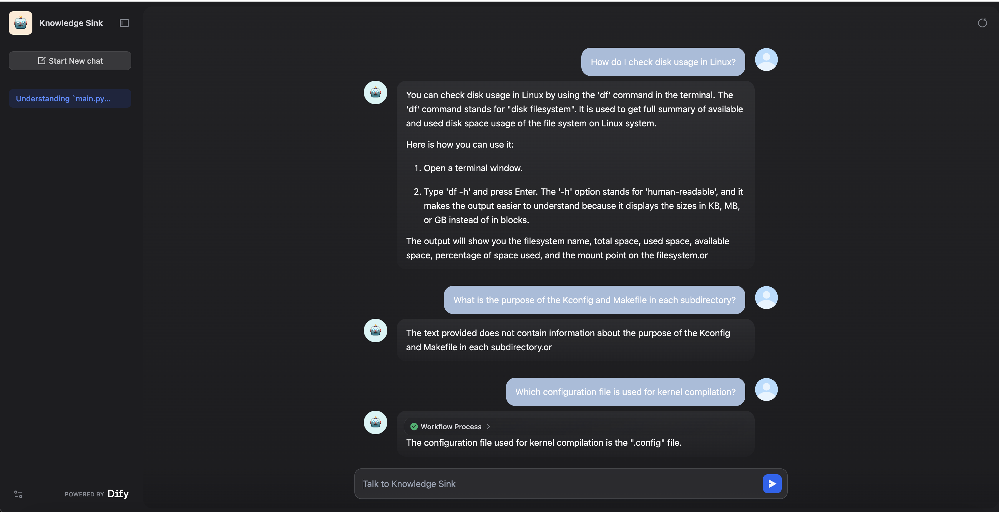
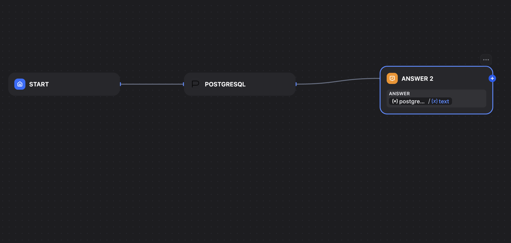
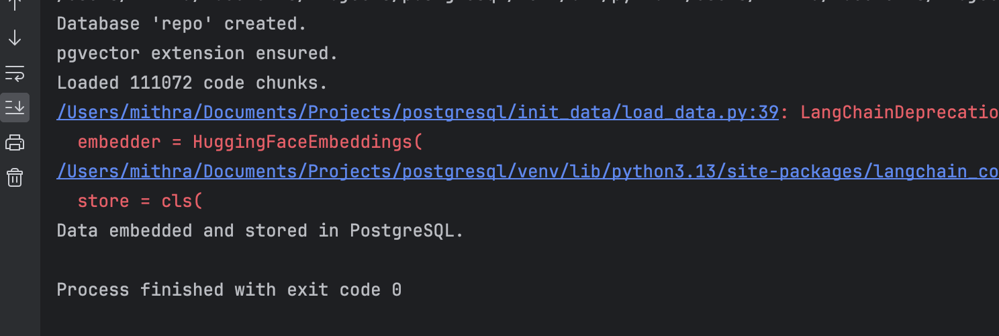

## postgresql

**Author:** mithra
**Version:** 0.0.1
**Type:** tool

### About Project
## Screenshots
### UI



### FLow


### Embed and Store Chunks into db using pgvector extension


# Postgres-powered Chatbot Plugin for Dify

This project is a custom Dify Plugin that enables intelligent Q&A over a code repository using PostgreSQL, pgvector, and LangChain. It powers a chatbot that answers technical questions based on embedded code files.

---

## Features

- Index and embed code repository files into PostgreSQL using pgvector.
- Build and run a custom Dify Plugin (`Tool` type).
- Use HuggingFace sentence embeddings (`all-MiniLM-L6-v2`).
- Query via LangChain's `RetrievalQA` with OpenAI GPT model.
- Integrated into Dify’s **Chat Flow**.
- Chatbot UI via Dify App.

---

## Architecture

```
User Query ──▶  Plugin Tool (PostgreSQL)
                                      │
                                      ▼
                          LangChain → Vector Store (pgvector)
                                      │
                                      ▼
                            Top-k Code Chunks + Answer
```

---

## Project Structure

```
postgresql-plugin/
├── main.py                        # Runs the plugin
├── manifest.yaml                  # Plugin metadata
├── provider/
│   └── postgresql.yaml            # Tool settings form (DB creds)
├── tools/
│   └── postgresql.py              # Core logic (RetrievalQA)
├── init_data/
│   ├── parse_repos.py             # Chunk loader for code repos
│   └── load_data.py               # Embedding + storing into DB
├── mock_data/
│   └── code_repos/                # Sample Linux repo files
```

---

## Embedding Pipeline

1. Files in `mock_data/code_repos/` are parsed and chunked by `parse_repos.py`.
2. Chunks are embedded using `sentence-transformers/all-MiniLM-L6-v2`.
3. Embeddings stored in PostgreSQL with `pgvector` extension.
4. LangChain connects to this DB during plugin calls.

---

## Chat Flow Setup in Dify

1. **Start Node** → takes user query.
2. **Tool Node** → invokes PostgreSQL plugin.
3. **Answer Node** → presents final answer to user.

---

## Tech Stack

- Python + FastAPI (via Dify Plugin)
- PostgreSQL + pgvector
- HuggingFace Transformers
- LangChain (RetrievalQA)
- Dify Agent Flow

---
## Contact

This is part of exploration for integrating custom tooling in Dify for internal knowledge systems.

---


